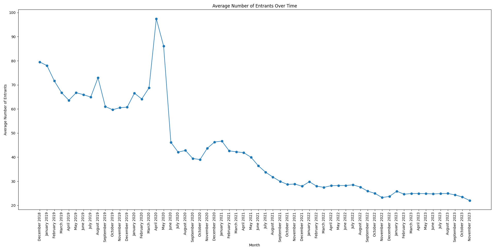
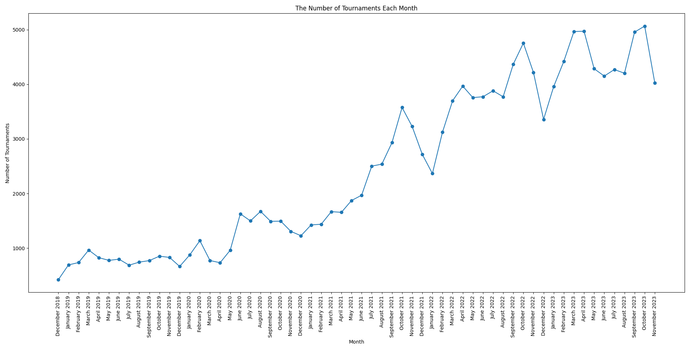
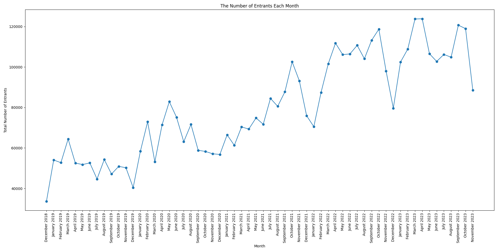
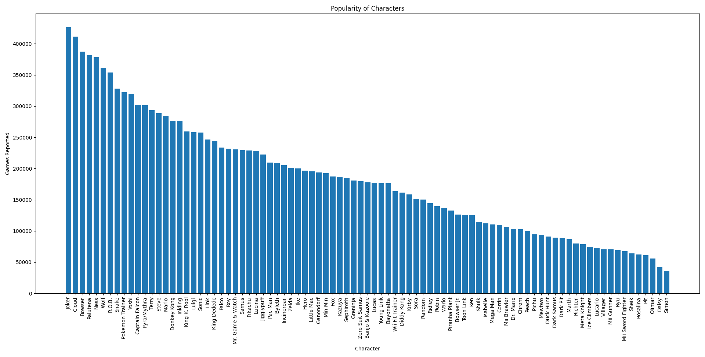
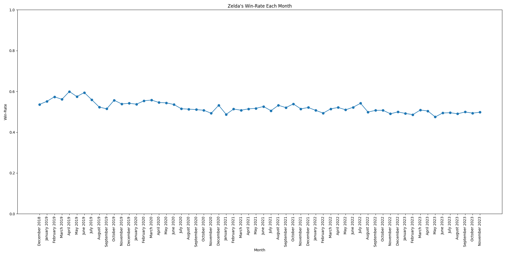
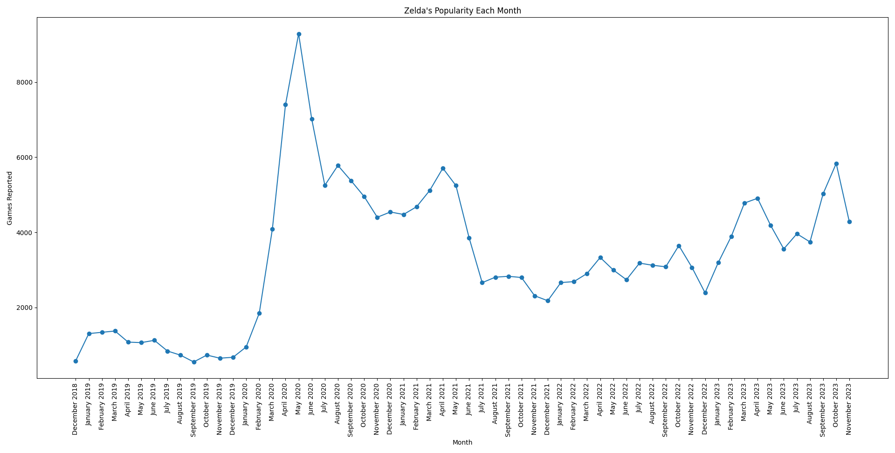

# DS 220 - Project #2
> Team Members:
> - Aryan Sinha

## Project Requirements
- Identify a raw public dataset of interest to you and download the raw data to your computer.
- Frame some 6 to 10 questions that you or others in the area may want to answer analyzing this data.
- Load your data set into a Pandas data frame and do some preprocessing and cleaning if needed (this should be documented).
- Perform exploratory data analysis & visualization.
- Map your questions as queries on the Pandas dataframe to generate answers.
- Derive insight(s) using answers to your questions.
- Communicate those insights as actionable text or a story that may be easy to communicate and share with others in the same dataset.
- Publish your work on github pages at a reachable URL.

## Identify a raw public dataset of interest to you and download the raw data to your computer
For this project, I will be using the SmashData Ultimate Player Database (which can be downloaded [here](https://github.com/smashdata/ThePlayerDatabase)). I am specifically using [this](https://github.com/smashdata/ThePlayerDatabase/releases/tag/v2023.11.26) release, which was published on November 27, 2023, and includes data up until November 26, 2023. This dataset is of great interest to me because I am an active member in the Super Smash Bros. Ultimate scene both here at Penn State, and outside of Penn State. I have met a lot of close friends through the scene and I feel I, along with many of those close friends, have a lot to gain from my analysis on this project. This dataset contains historical data on players, tournaments, and tournament sets (along with rankings, though I will not be using that).

The data is stored in an SQLite database, and thus all relevant data must be acquried from said database. The database includes the following tables:
- `players`, which contains information about players
- `ranking`, which contains ranking information about players
- `ranking_seasons`, which contains ranking information about players for each season
- `sets`, which contains information about tournament sets
- `tournament_info`, which contains information about tournaments

Out of these tables, I am only going to be using `players`, `sets`, and `tournament_info` for this assignment.


## Frame some 6 to 10 questions that you or others in the area may want to answer analyzing this data.
1. How has the average number of entrants for tournaments changed over time?
2. Who are the most played characters of all time?
3. How has a character's winrate changed over time?
4. How has a character's popularity changed over time?
5. How has a player's game winrate changed over time?
6. How has a player's set winrate changed over time?
7. What is a player's "best" character (their character with the highest winrate) and "worst" character (their character with the lowest winrate)?

## 1. How has the average number of entrants for tournaments changed over time?
The query for this specific question would be as follows:
```sql
/* Get the month and the average number of entrants that month */
SELECT STRFTIME('%m-%Y', start, 'unixepoch'), AVG(entrants)
/* From the tournament_info table */
FROM tournament_info
/* Where the tournament started on or after the game's launch */
WHERE start >= 1544158800
/* Group by month */
GROUP BY STRFTIME('%m-%Y', start, 'unixepoch')
/* Order by the start of the tournament in ascending order */
ORDER BY start ASC;
```
This does include some form of data cleaning, as there are a few tournaments that are listed as starting before December 7, 2018, which is the day the game released.

From there, I am able to load this data using the following code:
```py
import sqlite3 as sqlite

# The SQLite query
query = """
SELECT STRFTIME('%m-%Y', start, 'unixepoch'), AVG(entrants)
FROM tournament_info 
WHERE start >= 1544158800
GROUP BY STRFTIME('%m-%Y', start, 'unixepoch')
ORDER BY start ASC;
"""

# Connect to the database
conn = sqlite.connect("ultimate_player_database.db")
cursor = conn.cursor()

# Execute the query and retrieve the response
cursor.execute(query)
average_entrants_over_time = cursor.fetchall()

# Close the connection to the database
cursor.close()
conn.close()

import pandas as pd

# Import the data into a DataFrame
average_entrants_over_time_df = pd.DataFrame(average_entrants_over_time, columns=["Month", "Average Entrants"])
average_entrants_over_time_df["Month"] = pd.to_datetime(average_entrants_over_time_df["Month"], format="%m-%Y")
average_entrants_over_time_df["Month"] = average_entrants_over_time_df["Month"].dt.strftime("%B %Y")
```
This takes the data and puts it into a Pandas DataFrame, as well as converts the dates from `%m-%Y` format to `%B %Y` format. From there, I am able to export this data to a CSV file (and an image using Matplotlib) using the following code:
```py
# Export the data to a CSV file
average_entrants_over_time_df.to_csv("data/average_entrants_per_month.csv")

import matplotlib.pyplot as plt

# Create a line plot and a scatter plot with the data
plt.title("Average Number of Entrants Over Time")
plt.xlabel("Month")
plt.ylabel("Average Number of Entrants")
plt.xticks(rotation=90)
plt.plot(average_entrants_over_time_df["Month"].values, average_entrants_over_time_df["Average Entrants"].values)
plt.scatter(average_entrants_over_time_df["Month"].values, average_entrants_over_time_df["Average Entrants"].values)
plt.show()
```
The resulting graph would look like this:

As we can see, there is a strong downwards trend over time. At first, one may be led to believe this means the game is losing its competitive popularity. However, this data fails to identify one important thing - the number of tournaments occurring each month. That can be found using the following query and similar Python code:
```sql
/* Select the month and the number of tournaments */
SELECT STRFTIME('%m-%Y', start, 'unixepoch'), COUNT(*) 
/* From the tournament_info table */
FROM tournament_info 
/* That started after the game's release */
WHERE start > 1544158800 
/* Grouped by months */
GROUP BY STRFTIME('%m-%Y', start, 'unixepoch') 
/* In order of start time in ascending order */
ORDER BY start ASC;
```
This results in the following graph:

As we can see, this graph is showing a relatively strong upwards trend. We can confirm the game is becoming more popular over time by showing a graph of the total number of entrants each month. This is found using the following query and, again, similar Python code:
```sql
/* Select the month and the total number of entrants that month */
SELECT STRFTIME('%m-%Y', start, 'unixepoch'), SUM(entrants) 
/* From the tournament_info table */
FROM tournament_info 
/* That started after the game's release */
WHERE start > 1544158800 
/* Grouped by months */
GROUP BY STRFTIME('%m-%Y', start, 'unixepoch') 
/* In order of start time in ascending order */
ORDER BY start ASC;
```
This gives the following graph:

As we can very clearly see, there is also an upwards trend for the total number of entrants over time, though there is a good amount of variation in between months. The average number of entrants per month graph isn't necessarily good for determining how popular the game is each month, rather it is useful for figuring out how many entrants to expect at an average local tournament, both over time and during specific months. For example, every January ever since January 2020 has seen a slight increase in the average number of entrants before slowly settling back down. Tournament organizers can use this data in order to somewhat accurately prepare for their local tournaments.

## 2. Who are the most played characters of all time?
This question requires the game data for each set in order to determine how many games were played by each character. First, this is the query we will be using:
```sql
/* Select the game data */
SELECT game_data
/* Select this data from the sets table */
FROM sets
/* Only select sets with valid game data */
WHERE game_data IS NOT NULL
  AND game_data != '[]';
```
We can use the following Python code in order to take this data and put it into a DataFrame:
```py
import sqlite3 as sqlite

query = """
SELECT game_data
FROM sets
WHERE game_data IS NOT NULL
  AND game_data != '[]';
"""

# Connect to the database
conn = sqlite.connect("ultimate_player_database.db")
cursor = conn.cursor()

# Execute the query and retrieve the response
cursor.execute(query)
sets = cursor.fetchall()

# Close the connection to the database
cursor.close()
conn.close()

# Count the number of games reported for each character
played_dict = dict()

# A dictionary containing the names of all of the characters
character_name_dict = { ... } 

import json

# For each of the reported sets
for set_json in sets:
    # Get the game data
    game_data = json.loads(set_json[0])

    # For each game in the set
    for game in set:
        # Get teh reported winner and loser characters
        winner_char = character_name_dict[game["winner_char"]]
        loser_char = character_name_dict[game["loser_char"]]

        # Update the winner character's game count
        if winner_char is not None:
            if winner_char not in played_dict:
                played_dict[winner_char] = 0

            played_dict[winner_char] += 1

        # Update the loser character's game count
        if loser_char is not None:
            if loser_char not in played_dict:
                played_dict[loser_char] = 0

            played_dict[loser_char] += 1

# Sort the play count dictionary by game count descending
played_dict = sorted(played_dict.items(), reverse=True, key=lambda character: character[1])

import pandas as pd

# Convert the dictionary to a DataFrame
game_count_df = pd.DataFrame(played_dict, columns=["Character", "Games Reported"])
```
We can export this to a CSV file and also graph it:
```py
# Export the data to a CSV file
game_count_df.to_csv("data/most_popular_characters_of_all_time.csv")

import matplotlib.pyplot as plt

# Plot the data
plt.title("Popularity of Characters")
plt.xlabel("Character")
plt.ylabel("Games Reported")
plt.xticks(rotation=90)
plt.bar(game_count_df["Character"].values, game_count_df["Games Reported"].values)
plt.show()
```
The following graph represents this data:

As you can see, the top 5 most popular characters are:
1. Joker
2. Cloud
3. Bowser
4. Palutena
5. Ness

I feel as though all of these characters make sense. The former best player in the world, MKLeo, used to play Joker. Many players would want to emulate him, leading them to choose this character. Cloud is also a very popular pick. A current contender for the best player in the world, Sparg0, plays Cloud and many players would also want to emulate him. Bowser is considered a very easy character, meaning many players will gravitate towards him. The same is true for Palutena and Ness. I am surprised to not see Kazuya, R.O.B., or Steve, as these characters are often considered to be the most "meta relevant."

## 3. How has a character's winrate changed over time?
This question will require multiple queries. To start, we will need to make a query for each month in this database:
```sql
/* Select the month */
SELECT STRFTIME('%m-%Y', start, 'unixepoch')
/* From the tournament_info table */
FROM tournament_info
/* That happened after the game's release */
WHERE start >= 1544158800
/* Group by month */
GROUP BY STRFTIME('%m-%Y', start, 'unixepoch')
/* In ascending order */
ORDER BY START ASC;
```
From this, we're able to get a list of each month in this database. This will help with being able to use a newer, more updated version of the database as needed. From here, we would iterate through each individual month and get each tournament that occurred that month:
```sql
/* Select the tournament key */
SELECT key
/* From the tournament_info table */
FROM tournament_info
/* Which occurred in the specified month */
WHERE STRFTIME('%m-%Y', start, 'unixepoch') = '<month>';
```
Where `<month>` is replaced with the individual month from this specific iteration. From there, we can find all of the sets that occurred in this tournament with any games reported for the specific character:
```sql
/* Select the game data */
SELECT game_data
/* From the sets table */
FROM sets
/* That occurred in one of the specific tournaments */
WHERE tournament_key IN <tournament_list>
  /* And there is valid game data */
  AND game_data IS NOT NULL
  AND game_data != '[]'
  /* And one of the games included the character of interest */
  AND game_data LIKE '%<character>%'
```
Where `<tournament_list>` is a list of all tournaments that occurred this month and `<character>` is the specific character we are interested in. Putting it all together, this is what our code would look like:
```py
import sqlite3 as sqlite

query = """
SELECT STRFTIME('%m-%Y', start, 'unixepoch')
FROM tournament_info
WHERE start >= 1544158800
GROUP BY STRFTIME('%m-%Y', start, 'unixepoch')
ORDER BY START ASC;
"""

# Connect to the database
conn = sqlite.connect("ultimate_player_database.db")
cursor = conn.cursor()

# Execute the query and convert the data from a list of tuples to a list of strings
cursor.execute(query)
months = cursor.fetchall()
months = [ months[0] for month in months ]

import pandas as pd

# Create the DataFrame
win_rate_df = pd.DataFrame(columns=["Month", "Games Won", "Games Reported", "Win-Rate"])

# The desired character to check
character = 'ultimate/zelda'

import json

# Iterate through all of the months
for month in months:
    query = f"""
    SELECT key
    FROM tournament_info
    WHERE STRFTIME('%m-%Y', start, 'unixepoch') = '{month}';
    """

    # Execute the query and convert the data from a list of tuples to a list of strings
    cursor.execute(query)
    tournaments_in_month = cursor.fetchall()
    tournaments_in_month = [ tournament[0] for tournament in tournaments_in_month ]

    # Edge case: if there are no tournaments in this month (which shouldn't happen but just in case) then skip this month
    if len(tournaments_in_month) == 0:
        win_rate_df.loc[len(win_rate_df)] = [ month, 0, 0, 0 ]
        continue

    query = f"""
    SELECT game_data
    FROM sets
    WHERE tournament_key IN {tuple(tournaments_in_month)}
      AND game_data IS NOT NULL
      AND game_data != '[]'
      AND game_data LIKE '%{character}%';
    """

    # Execute the query and convert the data from a list of tuples to a list of strings
    cursor.execute(query)
    sets_in_month_with_character = cursor.fetchall()
    sets_in_month_with_character = [ sets_in_month_with_character[0] for set_in_month in sets_in_month_with_character ]

    # Edge case: if there are no reported games for this characer in this month (which is likely to happen) then skip this month
    if len(sets_in_month_with_character) == 0:
        win_rate_df.loc[len(win_rate_df)] = [ month, 0, 0, 0 ]
        continue

    # Track the number of games won and the number of games reported
    games_reported = 0
    games_won = 0

    # For each set
    for set_json in sets_in_month_with_character:
        # Get the game data as an object
        game_data = json.loads(set_json)

        # For each game in this set
        for game in game_data:
            # Get the winner and loser characters
            winner_char = game["winner_char"]
            loser_char = game["loser_char"]

            # Update the games reported and won counts
            if winner_char == character:
                games_reported += 1
                games_won += 1
            elif loser_char == character:
                games_reported += 1

    # Close the connection to the database
    cursor.close()
    conn.close()

    # Calculate the win-rate (while accounting for the edge case of games_reported being 0 to prevent a divide by zero)
    win_rate = 0

    if games_reported != 0:
        win_rate = games_won / games_reported

    win_rate_df.loc[len(win_rates_df)] = [ month, games_won, games_reported, win_rate ]

# Convert the dates from %m-%Y format to %B %Y format
win_rate_df["Month"] = pd.to_datetime(win_rate_df["Month"], format="%m-%Y")
win_rate_df["Month"] = win_rate_df["Month"].dt.strftime("%B %Y")
```
From here, we can export the data to a CSV file and graph the information:
```py
# Export the data to a CSV file
win_rate_df.to_csv("data/zelda_win_rate.csv")

import matplotlib.pyplot as plt 

# Graph the data to a line plot and a scatter plot
plt.title("Zelda's Win-Rate Each Month")
plt.xlabel("Month")
plt.ylabel("Win-Rate")
plt.xticks(rotation=90)
plt.ylim(0.0, 1.0)
plt.plot(win_rate_df["Month"].values, win_rate_df["Win-Rate"].values)
plt.scatter(win_rate_df["Month"].values, win_rate_df["Win-Rate"].values)
plt.show()
```
Running this code for Zelda gives the following graph:

We can see the win-rate has remained approximately the same at around 0.5, but has gone slightly down over time. This could mean a few things. For example, it could mean that Zelda players are getting progressively worse, which is unlikely. It could mean players are getting better against Zelda players, which is likely. It could mean many new players are joining whilst playing Zelda and are likely losing to more experienced and better players, which is the most likely. While it is impossible to know the exact cause, we can speculate.

## 4. How has a character's popularity changed over time?
The code from the previous question can be reused here. The only difference is that in graphing it, we want to graph the `"Games Reported"` field instead of the `"Win-Rate"` field, which would look like this:
```py
# Graph the data to a line plot and a scatter plot
plt.title("Zelda's Popularity Each Month")
plt.xlabel("Month")
plt.ylabel("Games Reported")
plt.xticks(rotation=90)
plt.plot(win_rate_df["Month"].values, win_rate_df["Games Reported"].values)
plt.scatter(win_rate_df["Month"].values, win_rate_df["Games Reported"].values)
plt.show()
```
This would result in this graph:


## 5. How has a player's game winrate changed over time?
## 6. How has a player's set winrate changed over time?
## 7. What is a player's "best" character (their character with the highest winrate) and "worst" character (their character with the lowest winrate)?